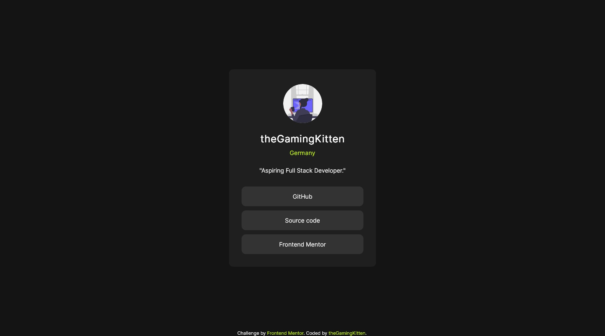
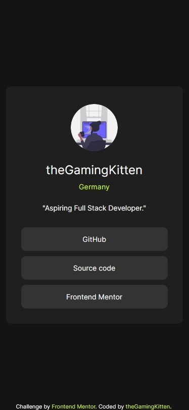

# Frontend Mentor - Social links profile solution

This is a solution to the [Social links profile challenge on Frontend Mentor](https://www.frontendmentor.io/challenges/social-links-profile-UG32l9m6dQ). Frontend Mentor challenges help you improve your coding skills by building realistic projects. 

## Table of contents

- [Overview](#overview)
  - [The challenge](#the-challenge)
  - [Screenshots](#screenshots)
  - [Links](#links)
- [My process](#my-process)
  - [Built with](#built-with)
  - [What I learned](#what-i-learned)
  - [Continued development](#continued-development)
  - [Useful resources](#useful-resources)
- [Author](#author)

## Overview

### The challenge

Users should be able to:

- See hover and focus states for all interactive elements on the page

### Screenshots




### Links

- Solution URL: [Source code](https://github.com/theGamingKitten/social-links-profile-react)
- Live Site URL: [Preview](https://social-links-profile-react-eight.vercel.app/)

## My process

### Built with

- Semantic HTML5 markup
- CSS custom properties
- Flexbox
- [React](https://reactjs.org/) - JS library
- SASS

### What I learned

This is my first project done in React and the second time I did the Social Links Profile Challenge.

After browsing several tutorials on React and not really understanding how to do things I decided to just start this project and look things up as I go.

My goal was to be able to create different profile cards for different people which can be accomplished with the following (in App.jsx):

```html
<Card 
    imgSrc={profileData.imgSrc}
    profileName={profileData.profileName}
    location={profileData.location}
    quote={profileData.quote}
/>
```

### Continued development

I want to continue learning React and the (for me) best way to do this is by doing projects like the ones provided by Frontend Mentor.

Also had a look at TypeScript before doing this project, so I'll use React with it in one of the next projects.

Since this is the second time doing this challenge, I recycled the css stylesheet from the previous version as my main focus was React. 

Afterwards I added SASS to the project as I wanted to practise partial stylesheets and adjusted the styling a little bit.

### Useful resources

- [React Docs (german)](https://de.legacy.reactjs.org/docs/getting-started.html) - Very good first resource for learning and trying out things in React. The updated version doesn't have a german translation so I had to use this.
- [React.dev (english)](https://react.dev/) - The same as above in english language only more recent

## Author

- Frontend Mentor - [@theGamingKitten](https://www.frontendmentor.io/profile/theGamingKitten)